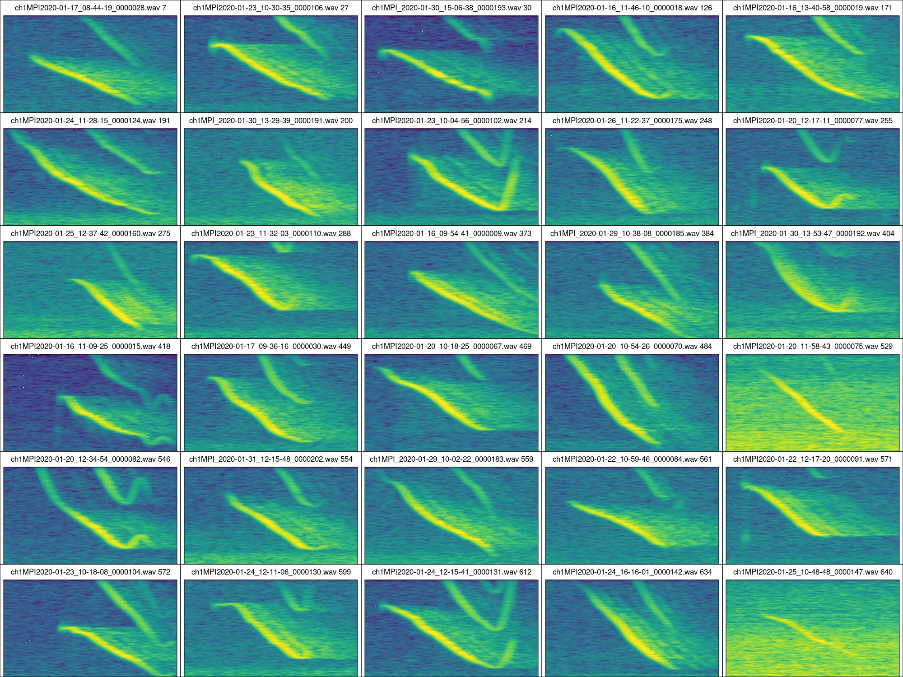

&nbsp;

<div class="alert alert-info">

### Purpose

- Showcase template-based automatic detection with the R package ohun using Spix's disc-winged bat social calls

</div>

&nbsp;

<div class="alert alert-warning">

### Data set

The data used in this tutorial (annotations and recordings) can be downloaded from here:

- [https://figshare.com/ndownloader/files/38431409](https://figshare.com/ndownloader/files/38431409)

</div>

&nbsp;

---

### Package installation

Install/load the package from CRAN as follows:

```{r, eval = FALSE}

# From CRAN would be
install.packages("ohun")

#load package
library(ohun)

```

To install the latest developmental version from [github](https://github.com/) you will need the R package [remotes](https://cran.r-project.org/package=remotes):

```{r, eval = FALSE}
remotes::install_github("maRce10/ohun")

#load package
library(ohun)

```

### Load additional packages
```{r packages, message = FALSE, warning = FALSE, echo = FALSE, eval = TRUE, message = FALSE, warning=FALSE}

## add 'developer/' to packages to be installed from github
x <- c("remotes", "maRce10/warbleR", "bioacoustics", "viridis", "ggplot2", "maRce10/ohun", "DT")

aa <- lapply(x, function(y) {
  
  # get pakage name
  pkg <- strsplit(y, "/")[[1]]
  pkg <- pkg[length(pkg)]
  
  # check if installed, if not then install 
  if (!pkg %in% installed.packages()[,"Package"])  {

      if (grepl("/", y))  remotes::install_github(y, force = TRUE) else
    install.packages(y) 
    }

  # load package
  try(require(pkg, character.only = T), silent = T)
})

```

```{r chunk opts, eval = TRUE, echo = FALSE}

opts_knit$set(root.dir = "..")

opts_chunk$set( fig.width = 8, fig.height = 3.5)

data_path <- "./data/raw/thyroptera/"

source("~/Dropbox/R_package_testing/ohun/R/get_templates.R")
source("~/Dropbox/R_package_testing/ohun/R/internal_functions.R")
```

```{r, message=FALSE, warning=FALSE}

library(warbleR)

library(ggplot2)

library(viridis)
```

```{r functions, eval = FALSE, echo = FALSE}

warbleR_options(wav.path = "./data/raw/thyroptera/", wl = 300, parallel = 1, bp = "frange", fast = F, threshold = 15, ovlp = 20)

```

```{r get sample of recordings from flight coordination paper, eval = FALSE, echo = FALSE}

fixed_calls <- read.csv( "./data/processed/manually_fixed_call_detections.csv")
table(fixed_calls)
table(fixed_calls$detection)
length(unique(fixed_calls$sound.files))

# p <- 1
# x <- 1
# while (p > 0.02){
# sub_calls <- fixed_calls[fixed_calls$sound.files %in% sample(unique(fixed_calls$sound.files), 30), ]

set.seed(7)
p <- sum(sub_calls$detection == "manual") / nrow(sub_calls)
# x <- x + 1
# }
sub_calls$channel <- 1
sub_calls <- sub_calls[, c("sound.files", "selec", "channel", "start", "end", "bottom.freq", "top.freq")]

sub_calls$selec <- 1:nrow(sub_calls)

write.csv(sub_calls, "~/Dropbox/Projects/ohun_paper/data/raw/thyroptera/manual_annotations_thyroptera.csv", row.names = FALSE)

wvs <- unique(sub_calls$sound.files)

file.copy(to = file.path("~/Dropbox/Projects/ohun_paper/data/raw/thyroptera/", wvs), from = file.path("~/Dropbox/Recordings/flight_coordination_Thyroptera/converted_sound_files_90_kHz/", wvs))

```

&nbsp;

### Set directory where the sound files and annotations are found

```{r, eval = FALSE, echo = TRUE}

data_path <- "DIRECTORY_WITH_SOUND_FILES_AND_ANNOTATIONS_HERE"

```

&nbsp;

### Read reference annotations
```{r read data, eval = TRUE, echo = FALSE}
# read data
manual_ref <- read.csv("./data/raw/thyroptera/manual_annotations_thyroptera.csv", stringsAsFactors = FALSE)

```

```{r read data 2, eval = FALSE, echo = TRUE}

manual_ref <- read.csv(file.path(data_path, "manual_annotations_thyroptera.csv"))

```

&nbsp;

### Create spectrograms to explore vocalization structure

This code creates a multipanel image with multiple spectrograms, one for each of the individuals/recordings in the complete data set (note that the output of the function `catalog` is a image file in the current working directory):
```{r Create catalogs, eval = FALSE}

# select highest signal to noise ratio calls per individual
manual_ref_snr <- signal_2_noise(X = manual_ref, mar = 0.05)

# select 1 example per sound file
high_snr <- manual_ref_snr[ave(-manual_ref_snr$SNR, manual_ref_snr$sound.files, FUN = rank) <= 1, ]

# create catalogs
catalog(X = high_snr, flim = c(10, 45), nrow = 6, ncol = 5, ovlp = 90, height = 10, width = 20, same.time.scale = TRUE, mar = 0.005, wl = 512, gr = FALSE, spec.mar = 0, lab.mar = 0.001, rm.axes = TRUE, by.row = TRUE, box = FALSE, pal = viridis, collevels = seq(-100, 0, 5), labels = NULL, path = data_path)

```

```{r fig for paper, eval = FALSE, echo = FALSE}

catalog(X = high_snr[1:15, ], flim = c(10, 45), nrow = 3, ncol = 5, ovlp = 90, height = 7.5, width = 20, same.time.scale = TRUE, mar = 0.005, wl = 512, gr = FALSE, spec.mar = 0.4, lab.mar = 0.2, rm.axes = TRUE, by.row = TRUE, box = TRUE, pal = viridis, parallel = 1, collevels = seq(-100, 0, 5), img.prefix = "thyroptera_15_calls", labels = NULL)

```



&nbsp;

### Split reference annotations for training and testing detection
```{r test and train, eval = TRUE, echo = TRUE}

set.seed(1)

train_files <- sample(unique(manual_ref$sound.files), size = 5)

test_files <- setdiff(manual_ref$sound.files, train_files)

train_ref <- manual_ref[manual_ref$sound.files %in% train_files, ]
test_ref <- manual_ref[manual_ref$sound.files %in% test_files, ]
```

&nbsp;

### Get diverse set of templates
```{r get templates, eval = TRUE, echo = TRUE, fig.height=7}

# find templates
templates <- get_templates(train_ref, path = data_path,  bp = c(10, 50), fast = TRUE, ovlp = , wl = 200, n.sub.spaces = 3)

```


```{r get templates 2, eval = FALSE, echo = TRUE}

# create ext. selection table
templates_est <- selection_table(templates, extended = TRUE, confirm.extended = FALSE, path = data_path)

templates_est <- rename_est_waves(templates_est, new.sound.files = templates$template)

```
&nbsp;

### Create spectrograms of templates

```{r Create catalog templates, eval = FALSE}

# create catalogs
catalog(X = templates_est, flim = c(10, 45), nrow = 2, ncol = 2, ovlp = 90, height = 10, width = 15, same.time.scale = TRUE, mar = 0.005, wl = 512, gr = FALSE, spec.mar = 0.4, lab.mar = 0.8, rm.axes = TRUE, by.row = TRUE, box = TRUE, pal = viridis, parallel = 10, collevels = seq(-100, 0, 5), img.prefix = "templates", path = data_path)

```

```{r catalog templates, out.width = "70%", echo = FALSE, fig.align= "center"}

knitr::include_graphics("./data/raw/thyroptera/templates-Catalog_p1.jpeg")

```

```{r, eval = FALSE, echo = FALSE}

saveRDS(templates_est, "./data/processed/templates_thyroptera_est.RDS")

```

&nbsp;

### Extract correlation vectors and optimize correlation threshold

```{r,  eval = FALSE, echo = TRUE}

corr_templ_train <- template_correlator(
  templates = templates_est,
    path = data_path, 
  files = unique(train_ref$sound.files), 
  hop.size = 10, 
  ovlp = 70
  )

opt_detec_train <- optimize_template_detector(
  reference = train_ref, 
  template.correlations = corr_templ_train,
  threshold = seq(0.1, 0.9, 0.05)
  )

```

```{r, eval = FALSE, echo = FALSE}

templates_est <- readRDS("./data/processed/templates_thyroptera_est.RDS")

paral <- 10

corr_templ_train <- template_correlator(
  templates = templates_est,
    path = data_path, 
  files = unique(train_ref$sound.files), 
  parallel = paral, 
  hop.size = 10, 
  ovlp = 70
  )

opt_detec_train <- optimize_template_detector(
  reference = train_ref, 
  template.correlations = corr_templ_train,
  threshold = seq(0.1, 0.9, 0.05), 
  parallel = paral
  )

opt_detec_train$templates <- gsub("-1$", "", opt_detec_train$templates)

saveRDS(opt_detec_train, "./data/processed/optimization_results_3_templates_thyroptera.RDS")

```

&nbsp;

### Create plot with threshold vs f1 score
```{r, eval = TRUE, echo = FALSE}

opt_detec_train <- readRDS("./data/processed/optimization_results_3_templates_thyroptera.RDS")


agg_f1 <- aggregate(f1.score ~ threshold + templates, data = opt_detec_train,
mean)

ggplot(agg_f1, aes(x = threshold, y = f1.score, group = templates, color = templates)) +
geom_line() + geom_point() + scale_color_viridis_d(end = 1) + theme_classic()

```

&nbsp;

### Check subset with highest performance (sorted by f1 score)

```{r, eval = FALSE}

opt_detec_train <- opt_detec_train[order(opt_detec_train$f1.score, decreasing = TRUE), ]

sub_opt_detec_train <- opt_detec_train[1:10, c("templates","threshold", "true.positives", "false.positives",  "false.negatives", "recall", "precision", "f1.score")]

sub_opt_detec_train
```

```{r, eval = TRUE, echo = FALSE}

# subset with highest performance
opt_detec_train <- opt_detec_train[order(opt_detec_train$f1.score, decreasing = TRUE), ]

sub_opt_detec_train <- opt_detec_train[1:10, c("templates","threshold", "true.positives", "false.positives",  "false.negatives", "recall", "precision", "f1.score")]

# print dynamic table
oa_DT <- datatable(sub_opt_detec_train, editable = list(target = "row"), rownames = FALSE, style = "bootstrap",
    filter = "top", options = list(pageLength = 100, autoWidth = TRUE, dom = "ft"),
    autoHideNavigation = TRUE, escape = FALSE)

formatRound(table = oa_DT, columns = sapply(sub_opt_detec_train, is.numeric), 3)

```

&nbsp;

### Run detection on test files

We used a threshold of 0.45 as te centroid template seems to behave well across thresholds.
```{r, detect on all data 67, eval = FALSE, echo = TRUE}

# get correlation vectors for test files
corr_templ_test <- template_correlator(
  templates = templates_est[templates_est$sound.file == "centroid", ],
    path = data_path, files = unique(test_ref$sound.files), 
  hop.size = 10, 
  ovlp = 70
  )

# detect on test files
detec_test <- template_detector(
  template.correlations = corr_templ_test,
    threshold = 0.45
  )

```

&nbsp;

### Evaluate detection performance on test files
```{r, diagnose detect on all data 67, eval = FALSE, echo = TRUE}

diagnose_detection(reference = test_ref, detection = detec_test)

```

```{r, eval = FALSE, echo = FALSE}

saveRDS(detec_test, "./data/processed/detection_thyroptera_all_67%_template.RDS")

```

```{r, eval = TRUE, echo = FALSE}

detec_test <- readRDS("./data/processed/detection_thyroptera_all_67%_template.RDS")

dd <-diagnose_detection(reference = test_ref, detection = detec_test)

dd

dd$f1.score

```

&nbsp;

<div class="alert alert-info">

### Takeaways

- Good performance on detecting Spix's disc-winged social calls: F1 score was `r round(dd$f1.score, 3)` for the training data set and `r round(max(opt_detec_train$f1.score), 3)` for the testing data 

- Some merged positives were found but notice that there are some overlapping signals in the reference annotation as well (can be checked with `warbleR::overlapping_sels(manual_ref)`)

</div>

&nbsp;

---

<font size="4">Session information</font>

```{r session info, echo=F}

sessionInfo()

```